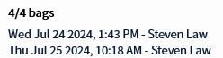
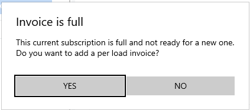
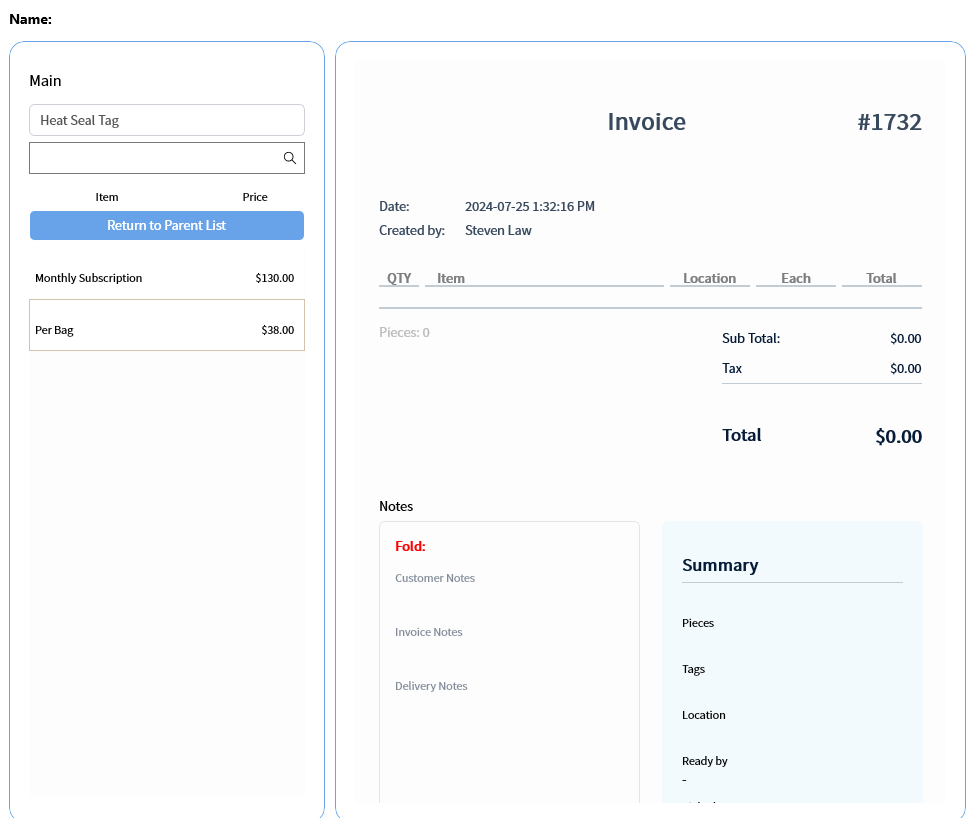
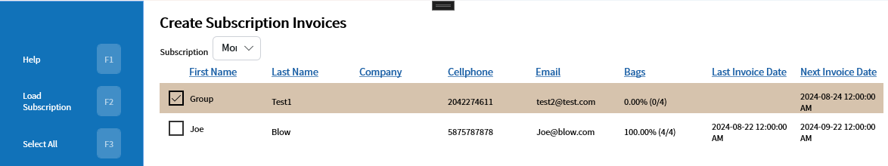
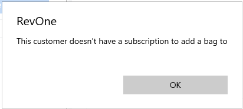

# Add Bag — AB
Updated 2024-05-31 version 0.3.1095

The Add Bag command allows one to keep track of the bags that have been used per [Subscription Invoice](Create-Subscription-Invoices-—-CSI.md)

If the subscription invoice is full an option to create new invoice with per bag items on them is available

If the subscription is on a sub list that also has a item that starts with per that sub list and item will be pre-selected.

If the AB command is run and the current customer is missing a Subscription Invoice or it due for a new one the [CSI](Create-Subscription-Invoices-—-CSI.md) command will be opened to the customer's subscription the customer already selected

If the customer ab is run on it will simply show an error message

