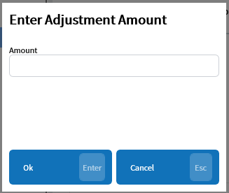

# Adjustment / Remove Adjustment — ADJ/RAJ
Updated 2024-04-23 version 0.3.1010

Allows adjustments to be made to the total of an invoice without throwing the payment reports out of line.

## Adjustment

Adds an adjustment line item to the invoice before taxes are calculated.

A reason must be entered to add an adjustment. The other option will allow a custom reason to be typed in.

A popup requesting the adjustment amount will be shown.

> ❗ In order to reduce the invoice total a negative amount must be entered.

The adjustment item will have the reason written in the invoice line and the amount stored as a coupon amount so that it shows up on the Discounts report.

## Remove Adjustment

The Remove Adjustment (RAJ) command will remove all adjustments on the current invoice.