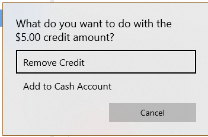

# Remove Coupon on Account Credit — RCAC
Updated 2024-05-21 version 1.0.48 (0.3.1018)

Removes credit that was put on a customer's account using coupon

- Remove Credit
    - Cancels the credit amount
- Add to Cash Account
    - Adds the credit amount to the normal credit account using an Adjustment payment