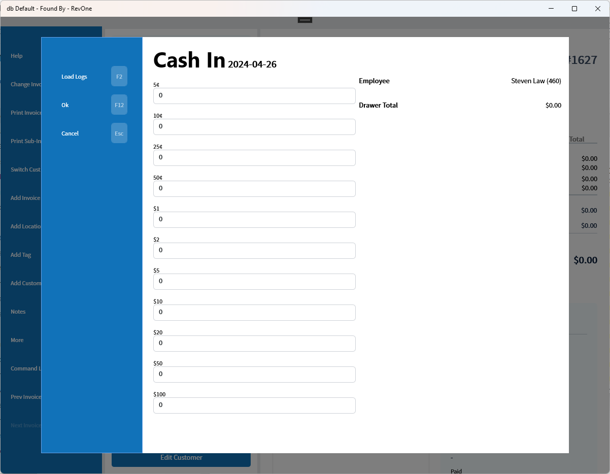
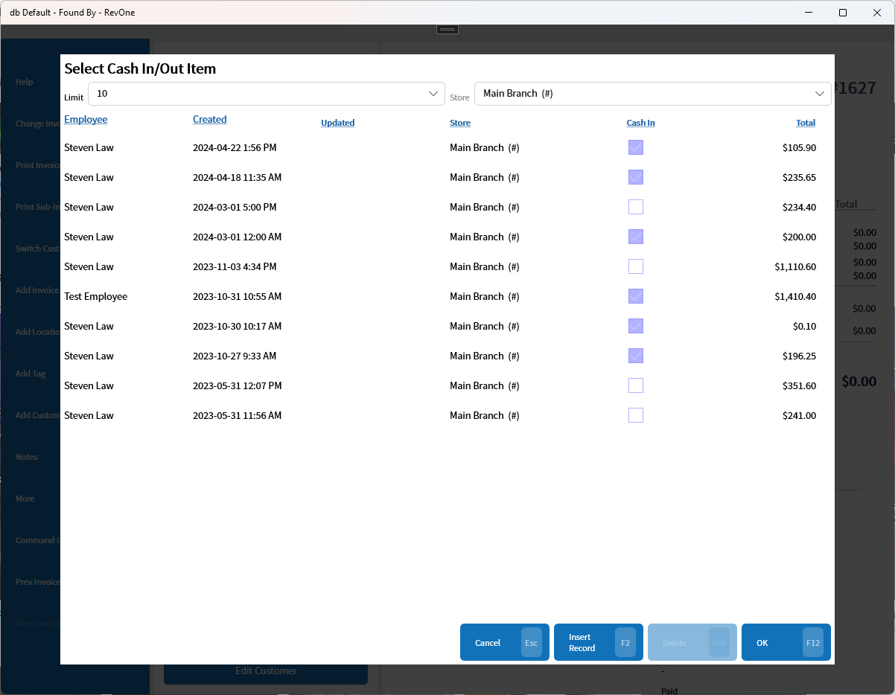

# Cash In/Out — CAI/CAO
Updated 2024-04-26 version 1.0.44.0 (0.3.1014)

Allows for the recording of the state of the cash drawer at cash in and out.

When cashing in the drawer total will be calculated automatically.

When cashing out the invoices since the last cash in will be shown and the difference will be calculated. Important to note is that the invoices will be from the last cash in if there is no intervening cash out so if there is a missing cash in and out then it can include multiple days.

Loading old reports requires manager authorization and allows the correction of an older report

Insert Record allows records to be inserted for specific days. If attempting to insert a record for a date that already has one it will prompt to edit the record instead

