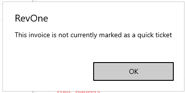

# Change Quick Ticket — CQT
Updated 2024-05-31 version 0.3.1080

Occasionally a quick ticket will fail to be marked as an invoice when items are added to it. This command's purpose is to correct this issue. If an invoice is marked as a quick ticket, has items on it, and this command is run it will be manually forced to be an invoice instead of a quick ticket

Quick Tickets that have failed to be converted can be found by using the [Find Unchanged Quick Ticket — UQT](Find-Unchanged-Quick-Ticket-—-UQT.md) command.

If the invoice is not marked as a quick ticket it will simply fail:

