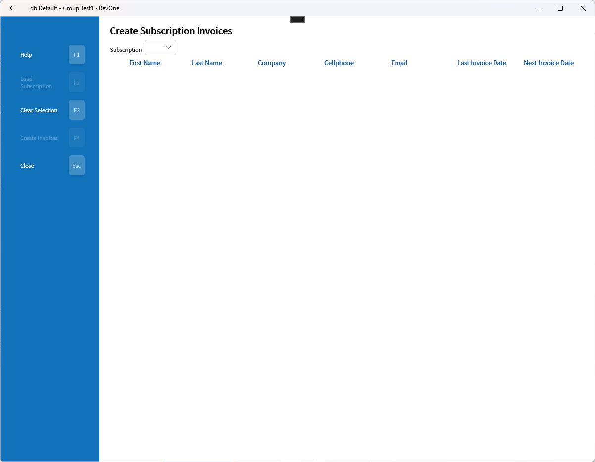
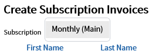
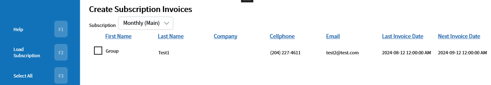
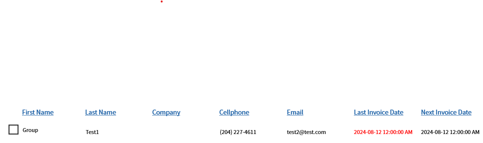

# Create Subscription Invoices — CSI
Updated 2024-05-31 version 0.3.1095

The Create Subscription Invoices command allows for the creating of all invoices for a specific subscription at once.

The subscription to create invoices for needs to be selected. The price list that the subscription is attached to is in parentheses.

Once a subscription is selected the customers can be loaded. The Create Invoices button will only create invoices for subscriptions that don't have a last invoice date in the past.

If the subscription invoice has been removed the last invoice date will be displayed in red and will be replaced by the Create Invoices button.

