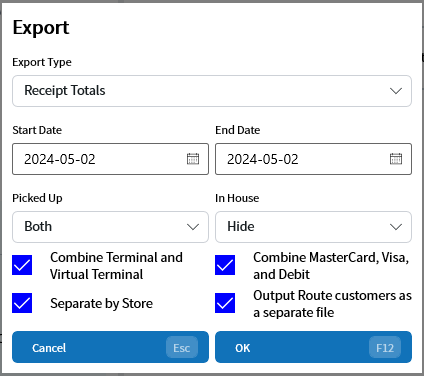
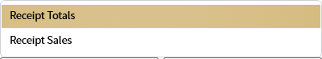
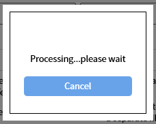
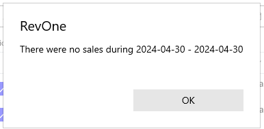

# Export Sales — EXP
Updated 2024-05-02 version 0.3.1022

Exports a list of sales for a selected date range.

| Parameter | Explanation |
| --- | --- |
| Export Type | The type of export to use |
| Start Date | The start of the date range (inclusive) |
| End Date | The end of the date range (inclusive) |
| Picked Up | Show all sales, only not picked up, only picked up (Both, Hide, Only) |
| In House | Show all sales, only not in house customers, only in house customers (Both, Hide, Only) |
| Combine Terminal and Virtual Terminal | Combines Terminal and Virtual Terminal transactions into a single payment type |
| Combine MasterCard, Visa, and Debit | Combines the three payment types into a single file leaving American Express separate |
| Separate by Store | Separates each store into its own file |
| Output Route customers as a separate file| Combines all route customers into a separate file treated like it's own store |

There are two types of exports: Receipt Totals and Receipt Sales

## Receipt Totals

Produces a single file containing the daily totals based on the payment type and store/route

## Receipt Sales

Breaks up the sales detail into multiple files based on the payment type and store/route

> ❗ If Separate by Store is turned off and Output Route customers as a separate file is turned on
it will result in all non-route customers being listed as Counter

As this can be a long running query the option to cancel out is given.

If there were no sales during the time period an error message will be displayed and no files written.

