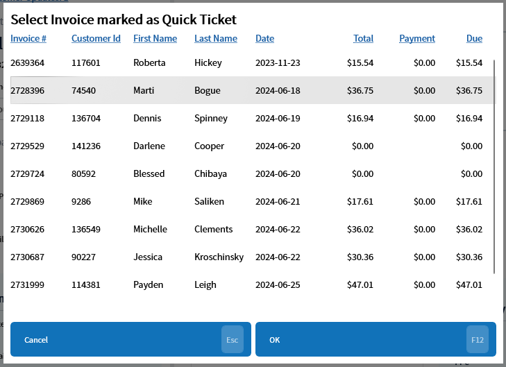

# Find Unchanged Quick Tickets — UQT
Updated 2024-05-31 version 0.3.1080

Occasionally a quick ticket will fail to be marked as an invoice when items are added to it. This command will find any invoice marked as a quick ticket but that has items attached to it. Once a quick ticket/invoice has been selected the [Change Quick Ticket — CQT](Change-Quick-Ticket-—-CQT.md) command can be used to convert it.

