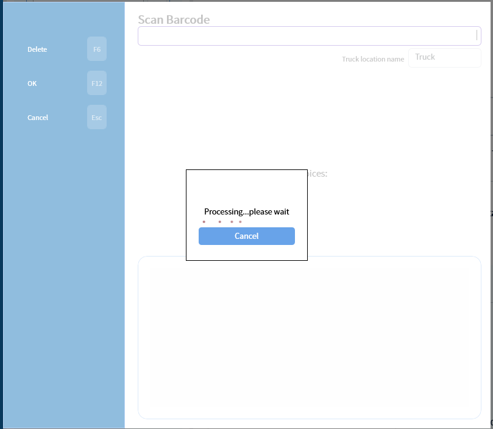

# Multiple Pickup — MU
Updated 2024-02-02 version 0.3.964

Scan multiple invoices/sub-invoices to mark them as picked up or on route

If the barcode doesn't register as a valid invoice or sub-invoice number it will show an error below

All items will be listed in reverse order in the list below

Only route customers invoices will be marked picked up and only if all the non empty sub-invoices have been scanned. Counter customer's invoices/sub-invoices will be marked as on the way

After hitting the OK (F12) button the processing indicator will allow for cancellation with the Cancel (Esc) button if the process is taking too long and something else is needed.

