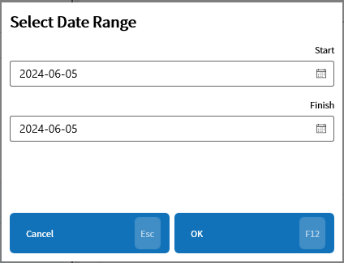
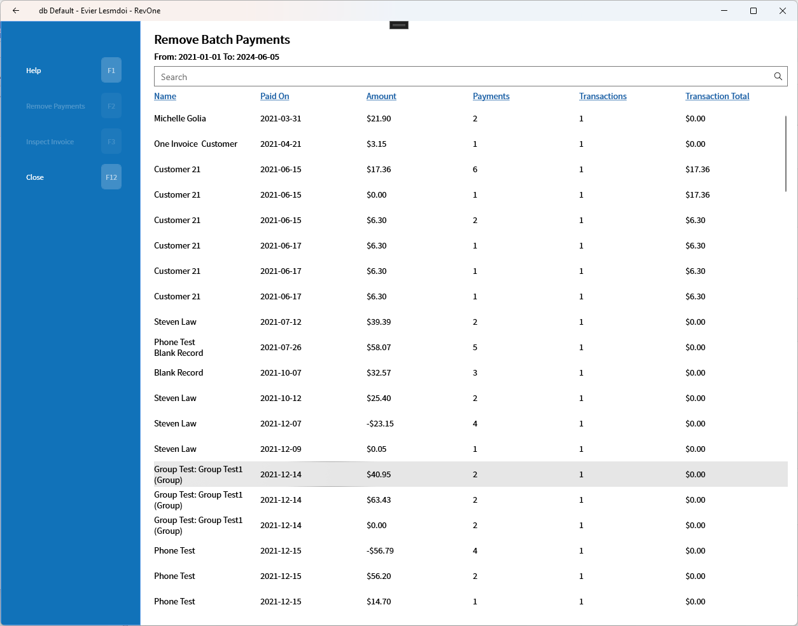
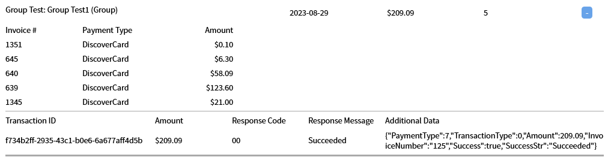
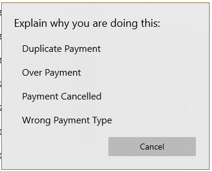
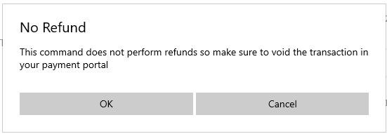
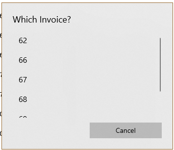

# Remove Batch Payments — RBP
Updated 2024-05-31 version 1.0.50 (0.3.1056)

Allows the viewing and removal of batch payments in a selected date range.

The date range needs to be selected first to avoid overloading the system by pulling every Batch Payment in the database.

The List of batch payments is shown and can be sorted or searched by name.

Each item can be expanded for more advanced information.

## Remove Payments

Selecting a batch payment will allow the payments associated with that batch to be removed. A reason needs to be selected for this to happen.

Refunds aren't done automatically in this command.

## Select Invoice

This button will open a list of invoice numbers which can be used to jump to that invoice to inspect it for further information.

