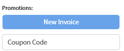
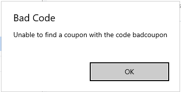
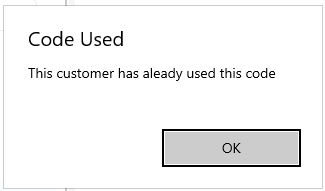
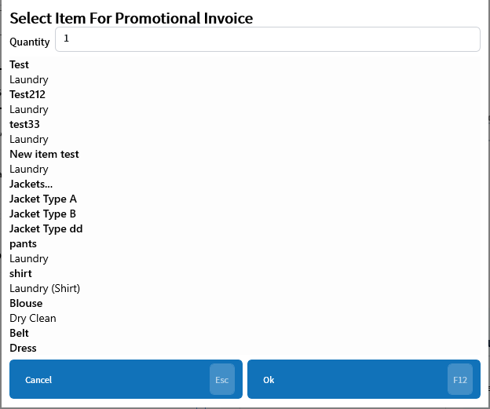

# Coupon Codes
Updated 2024-05-30 version 0.3.1040

Coupon codes allow a group of discounts to be linked to a code that can be sent by email and redeemed in store. The setup is in the [Managers section of Setup](../Setup/Manager/Coupon-Codes.md).

Once a code is setup it can be redeemed by entering the code into the coupon code text box in the promotions section:

If a bad code is entered it will display an error message.

If the customer has already used the code then a different message will be shown

Once the code is entered it will cycle through the list of discounts and allow the employee to select an item fore each one.

