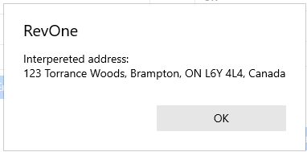
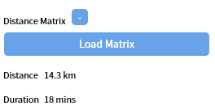

# Distance Matrix

> ❗ Incomplete function. The route calculation part of the distance matrix is not yet functional

## Customer Edit

The Distance Matrix is used to calculate the shortest route for different customer's. In the Customer Edit section is a [Distance Matrix section](../Functions/Customer-Editing.md#distance-matrix).

Opening the section with the `+` button shows the `Load Matrix` button.

Once the load button is pressed the API will attempt to validate the address. It can sometimes be wrong so it is a good idea to verify that the address found matches.

## Database Check Step

There is another part in the [Database Setup Check Steps](Database-Setup.md#check-steps) where it is possible to enable the "Fetch next 200 Distance Matrices" step. It is limited to 200 to prevent overwhelming the service.

