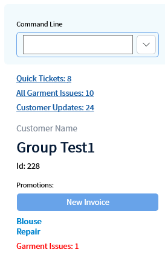
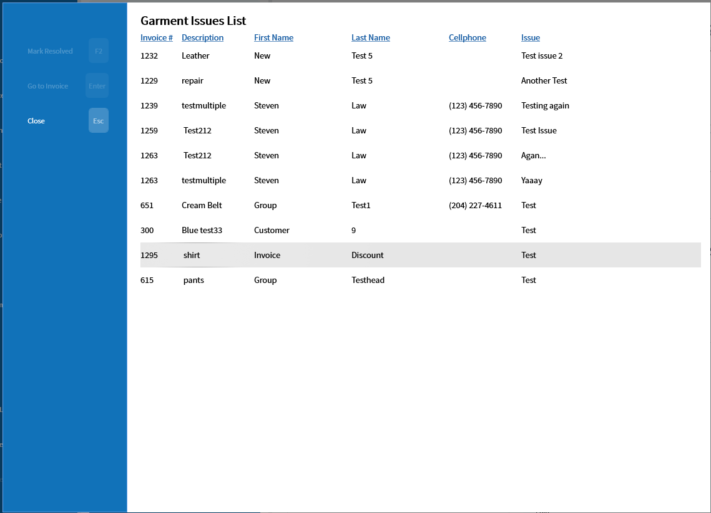
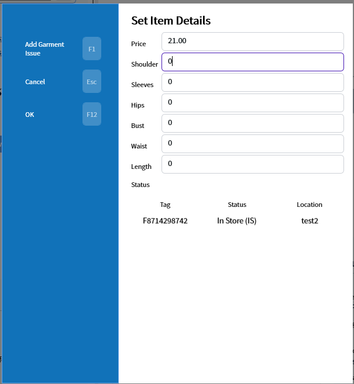
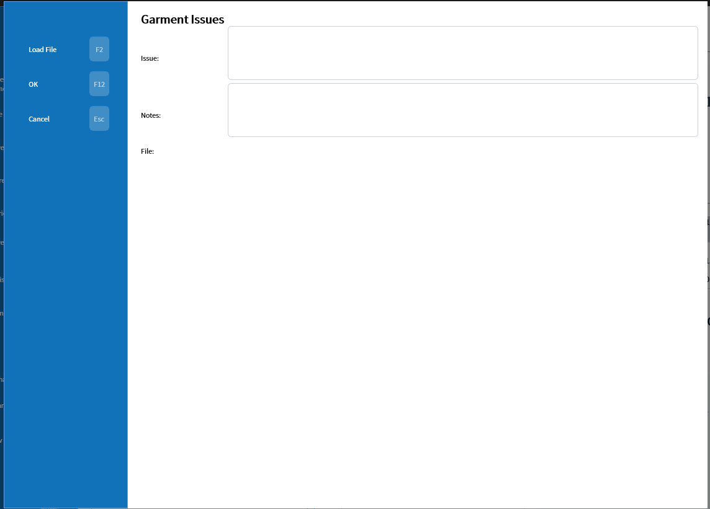

# Garment Issues

If an employee notices an issue with a customer's garment they can note it down sending a message to the customer allowing it be verified that it was pre-existing.

## Viewing Issues

In the customer summary on the main window there are two locations where the garment issues are shown. The first is between Quick Tickets and Customer Updates (if they are shown) under the command line, this shows all the garment issues in the system. The second is a red line that shows the current customer's garment issues under the promotions display. Clicking either of these will bring up a list of those garment issues.

In this list garment issues can be marked resolved (e.g. if they are fixed), jump to the affected invoice, or if the item is double clicked the issue can be viewed, edited.

## Adding Garment Issues

Double clicking on an item in the main screen will bring up the Set Item Details popup which contains a button to `Add Garment Issue`.

The Change Invoice screen also has this button.

Once in the Garment Issue popup you can fill out the information or use `Load File` to load an image off of the local computer.

> ? Cloud synced directories like OneDrives do not play nice with this file load function so such files may need to be moved to a non synced directory

Once the issue is filled out you can save the issue

