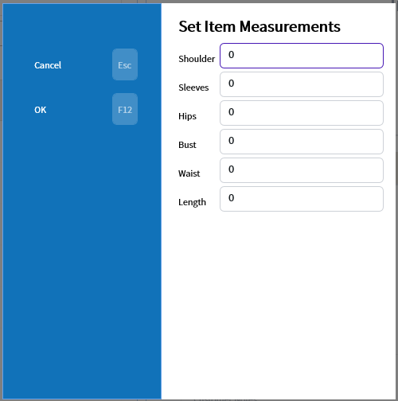
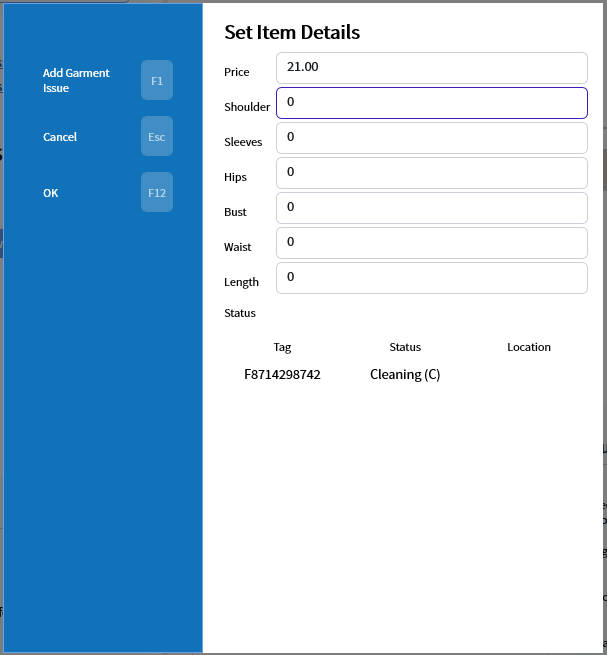

# Garment Measurement

A garment's measurements can be recorded to keep track of any shrinkage. In the add/change item window this is done with the `Measurements` button (F4).

Once inside the measurements can be recorded. The units are not tracked so this must be decided as company policy.

Double clicking on the item in the main invoice display will open the Set Item Details popup which also contains measurements.

