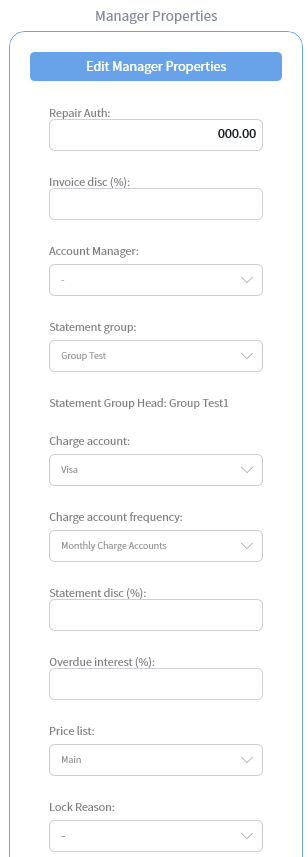
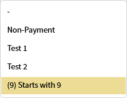
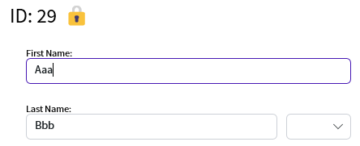
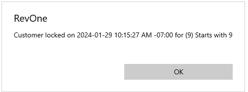
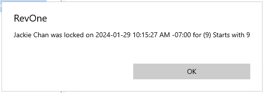

# Lock Customer

If a customer hasn't been paying their bills it can be useful to lock them out from creating any new invoices until the lock is cleared

## Locking the customer

Locking the customer can be done in either:

- [Process Charge Accounts](../Commands/Process-Charge-Accounts-—-PCA.md#lock-customers-with-errors)
- [Process Card Errors](../Commands/Process-Card-Errors-—-PCE.md#lock-customer)
- Manager Properties in the customer edit screen

In the manager properties you can select a preset reason to set a lock or the `-` to remove an existing lock.

## Displaying the reason

When a customer is locked a 🔒 will be displayed on the customer.

Beside the name in the customer summary.

Beside the id in the edit screen.

Beside the customer in the PCE screen.

Clicking on this symbol will display a popup with reason for the lock and the time that the lock was created.

> The "(9) Starts with 9" error is an internal testing error

## Effect

The only thing prevented when locked is creating a new invoice.

