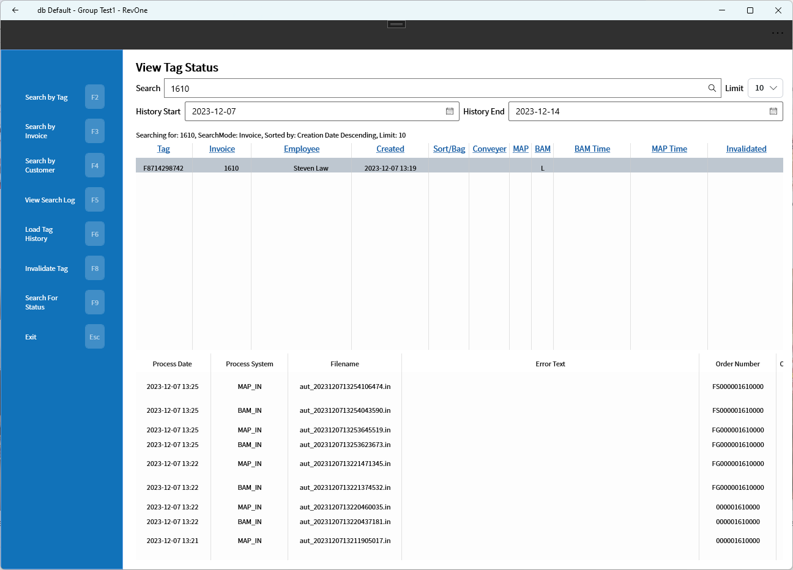

# Metal Progetti

Integration is possible with the Metal Progetti dry cleaner automation systems.

In order to use Metal Progetti you need to activate it in the [Setup>Invoices](../Setup/Manager/Invoices.md) page.

### [View Tag/Invoice Status](../Commands/Administration-Tools/View-Tag-Status-%257C-View-Invoice-Status-—-VTS%257CVIS.md)

In order to get some insight about how an invoices items are doing on the Metal Progetti system the View Tag/Invoice Status commands can be used.

[Heat Seal Tags](Heat-Seal-Tags.md) may need to be invalidated if the [Multiple Pickup — MU](../Commands/Multiple-Pickup-—-MU.md) or the ordinary pickup methods some miss invalidating.

It may be useful to look at the tag history for the log records coming from Metal Progetti.

One of the tasks may be to look for the timestamp of the Bagging Confirmation.

