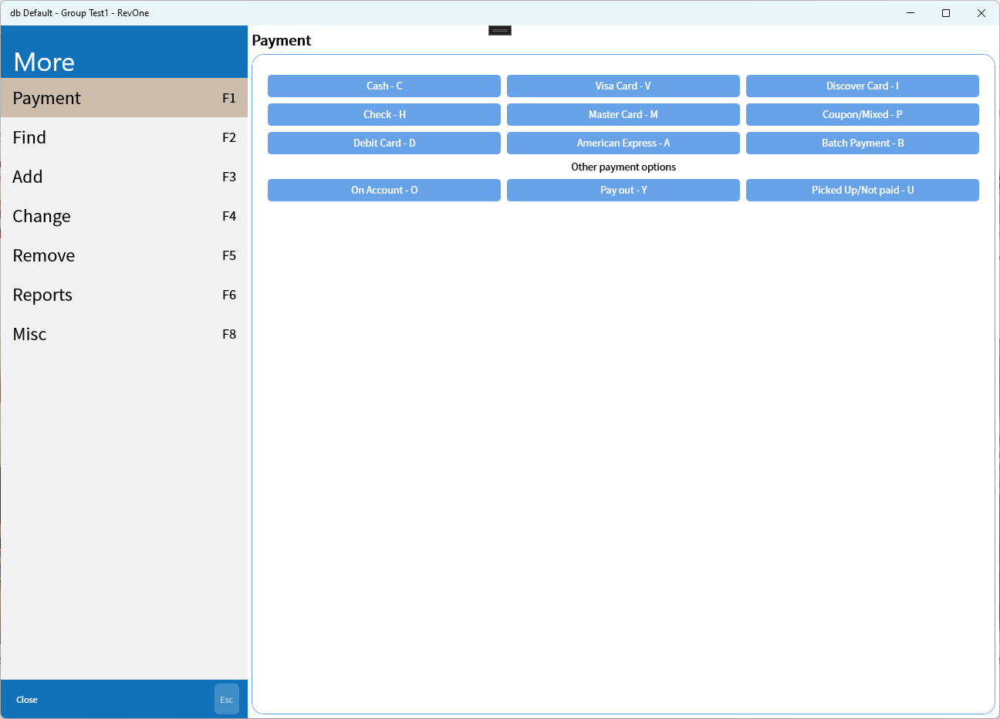
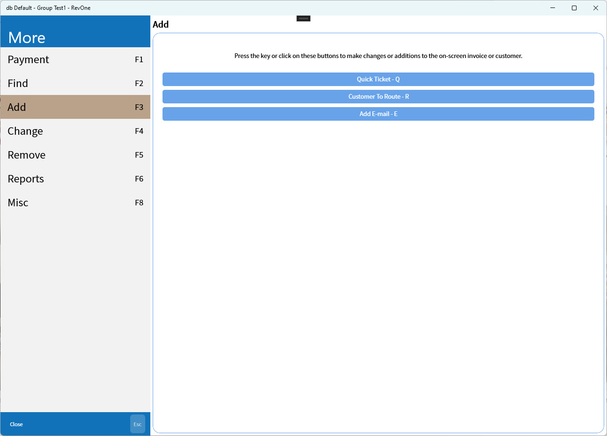
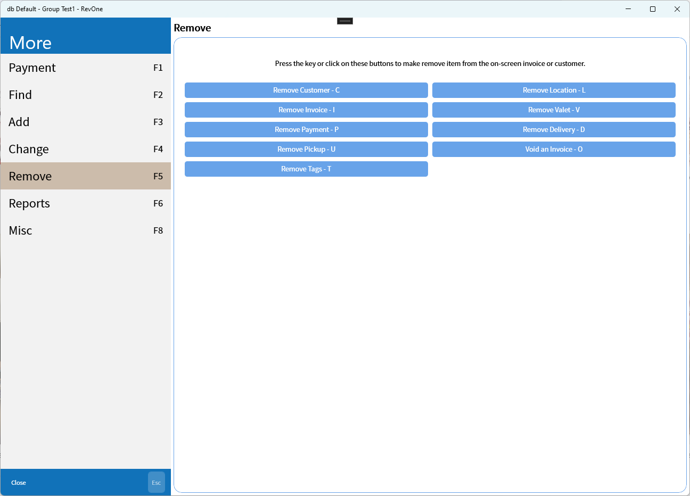
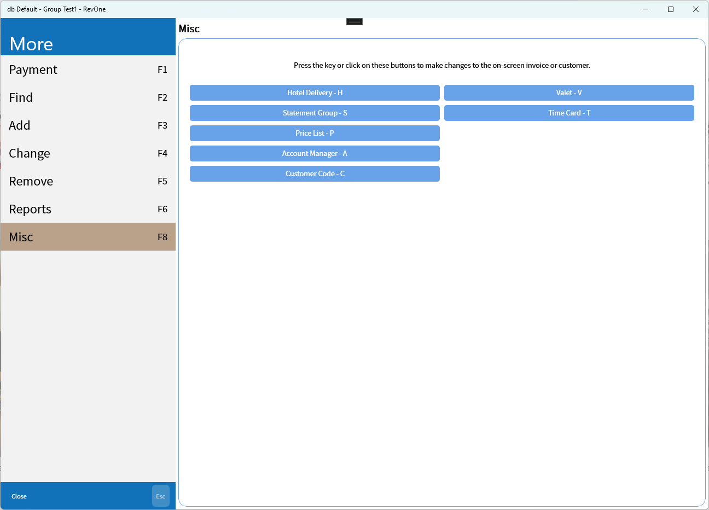

# More

## Payment

The payment functions can be accessed from here.

## [Find](More/Find.md)

The find tab contains multiple methods for finding customers or invoices. All of the search terms with a '=' sign in the name can also be searched for in the main screen's command line by using that prefix (e.g. Tag search with `T=F12345`).

## Add

## Change

## Remove

## [Reports](More/Reports.md)

## Misc

