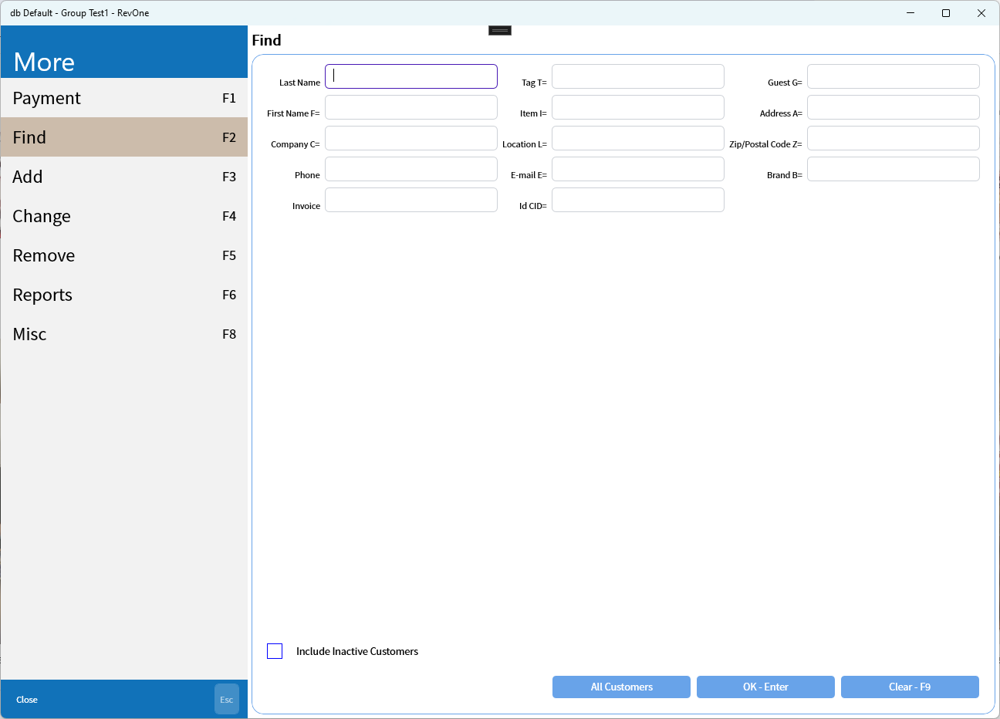
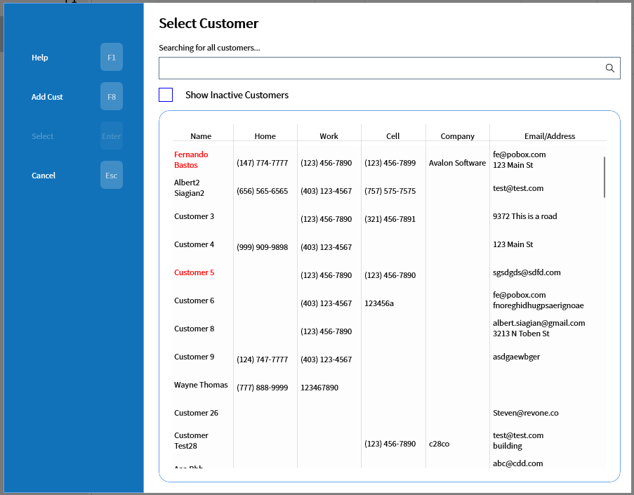
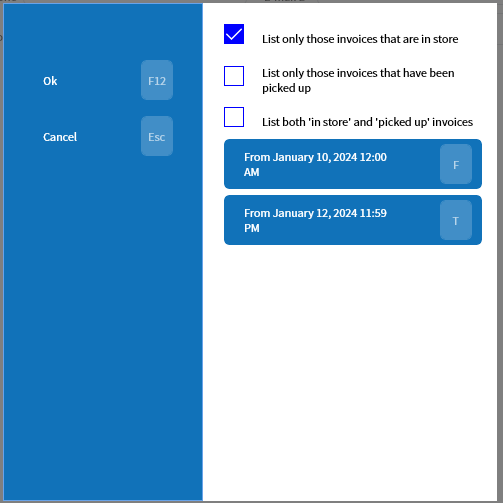
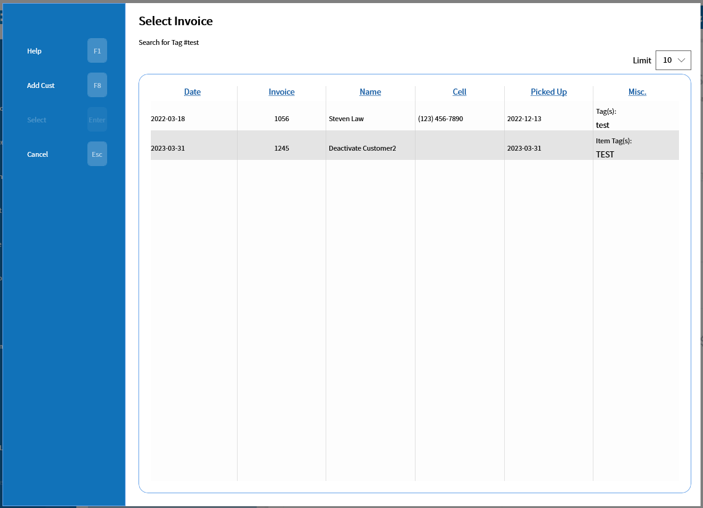

# Find

The find tab contains multiple methods for finding customers or invoices. All of the search terms with a '=' sign in the name can also be searched for in the main screen's command line by using that prefix (e.g. Tag search with `T=F12345`).

Customer searches will open the "Select Customer" popup if there is more than one found.

Invoice searches are filtered by invoice date and status.

This opens the "Select Invoice" popup

