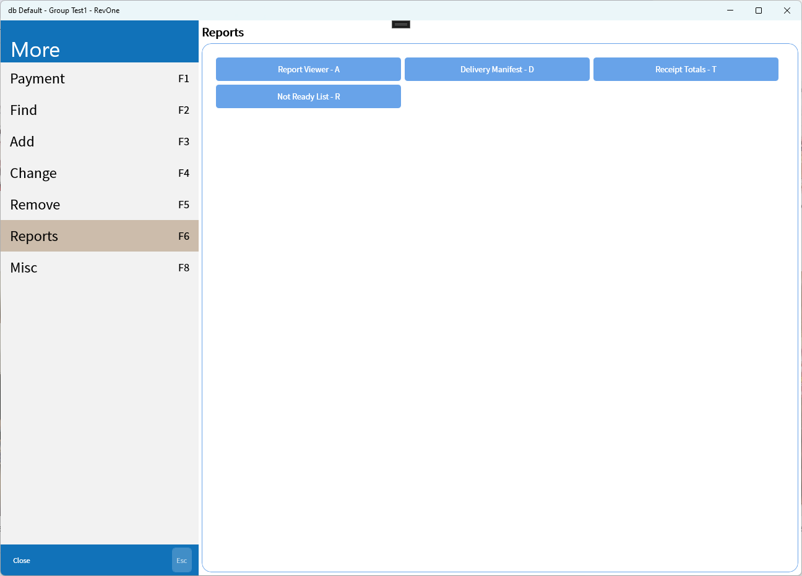
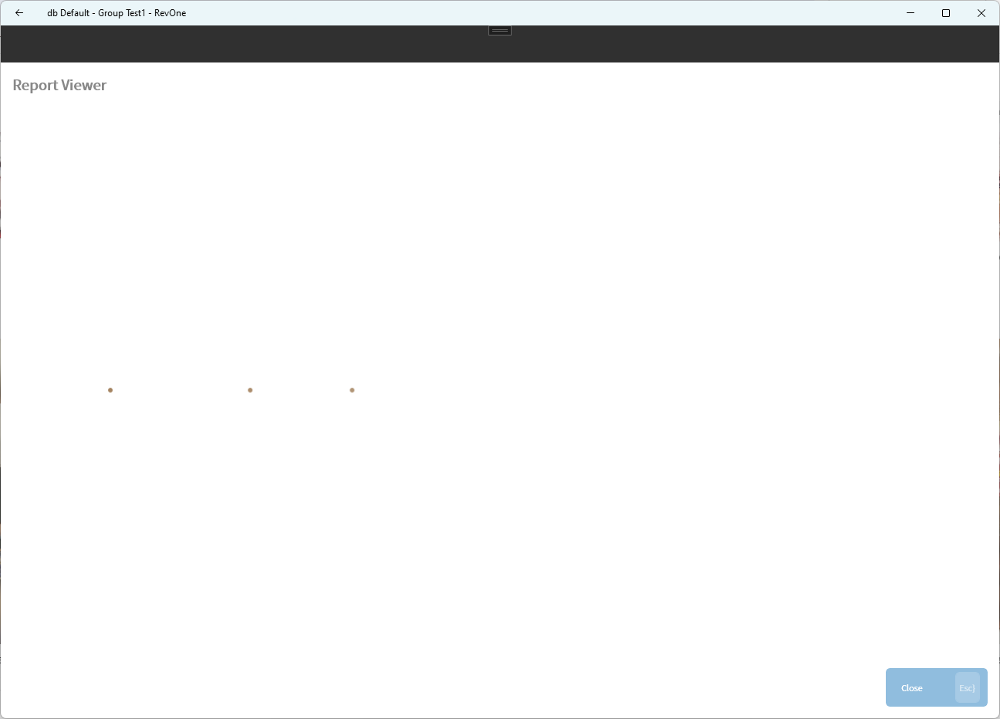
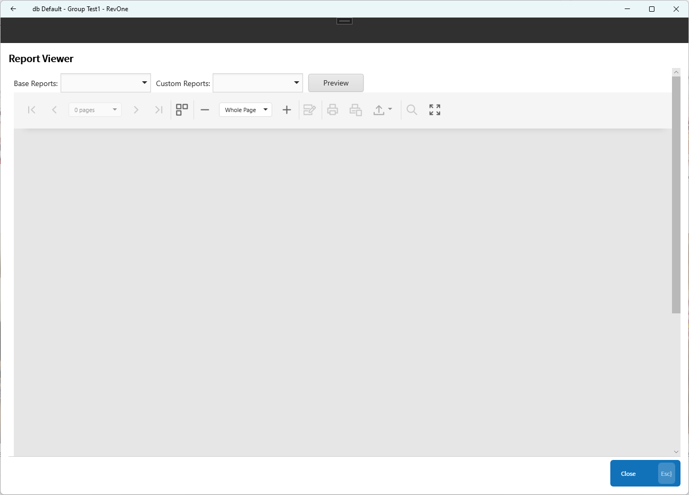
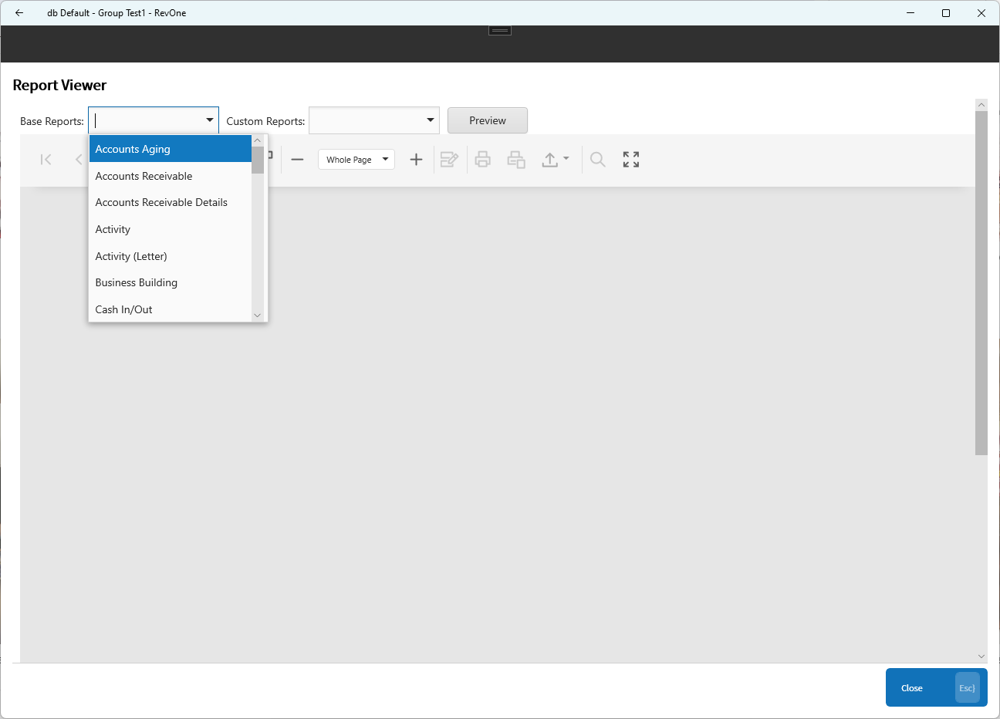
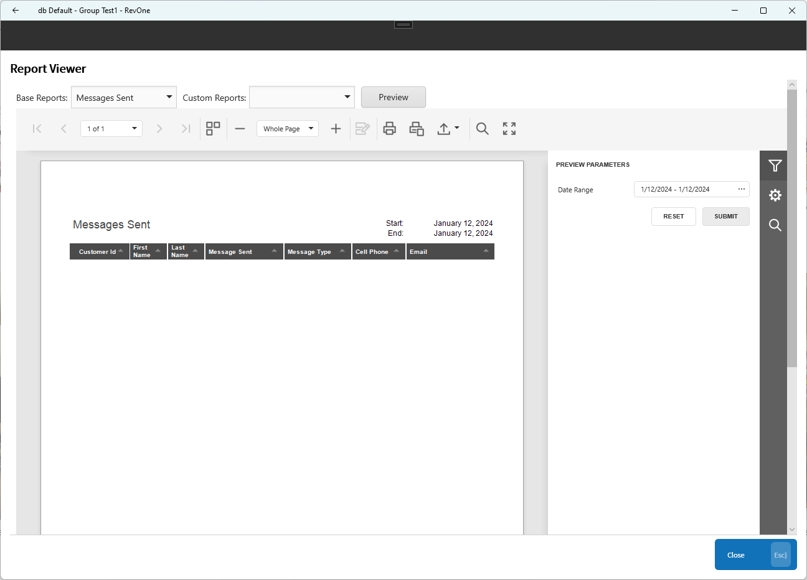
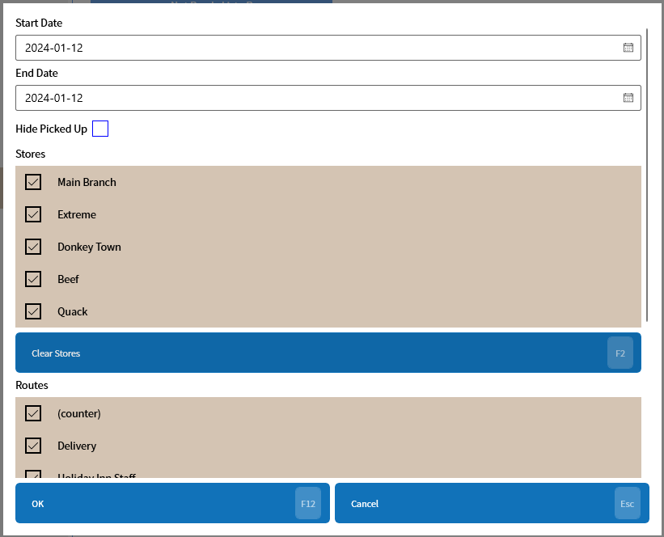
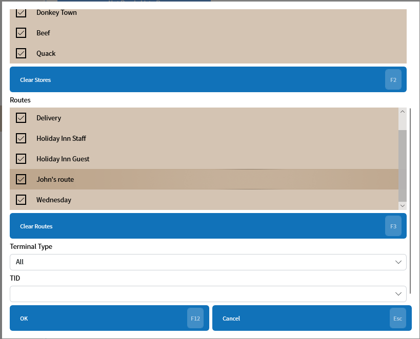
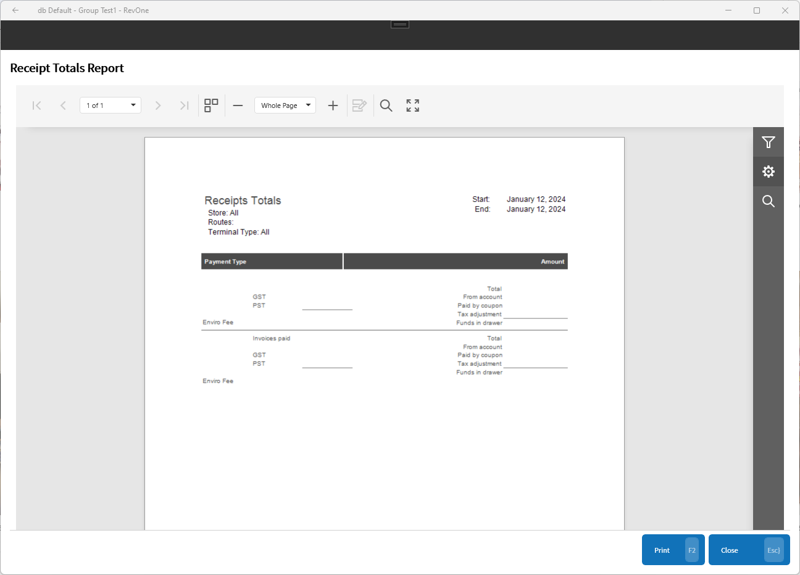

# Reports
Updated 2024-05-31 version 0.3.1059

Allows the loading of reports from inside revPOS.

Due to the report server being external it can take a bit longer to load the report Viewer

## Report Viewer

The report viewer can be used to display all of the reports on the server.

The report can be selected from the dropdowns on top of the page.

Once the report is loaded the parameters will open on the right of the page.

## Single Reports

A single report can be opened directly, this uses an in-application parameter dialog.

Many parameter dialogs will require scrolling to see all of the options.

After selecting the parameters the single report will be displayed.

