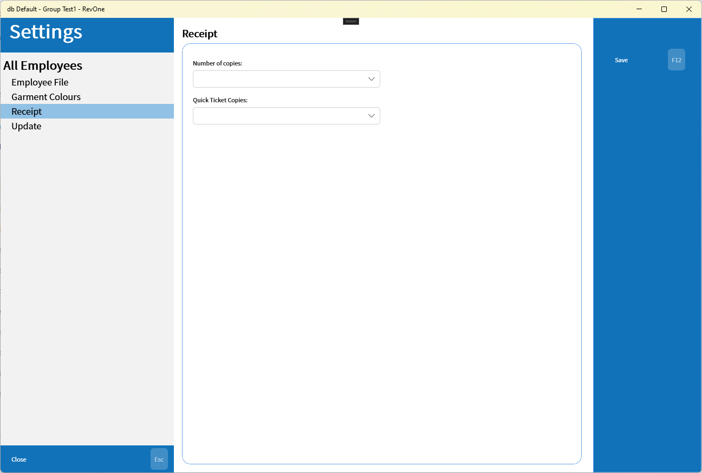

# Receipt

Gives front counter employees the ability to set the number of copies of receipts to print for invoices and quick tickets without access to the rest of the settings for invoices

| Setting | Explanation | Scope |
| --- | --- | --- |
| Number of Copies | The number of copies of the receipt to print per invoice | Machine Specific |
| Quick Ticket Copies | The number of copies of the receipt to print per quick ticket | Machine Specific |