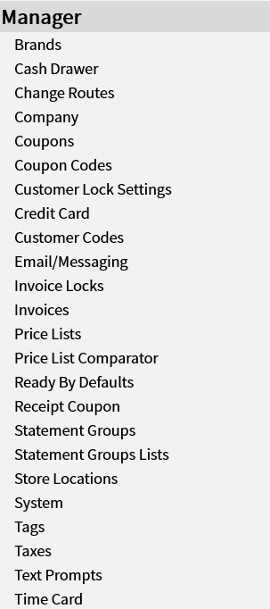

# Manager

Functions only available to managers

> - [Brands](Manager/Brands.md)
> - [Cash Drawer](Manager/Cash-Drawer.md)
> - [Change Routes](Manager/Change-Routes.md)
> - [Charge Account Frequencies](Manager/Charge-Account-Frequencies.md)
> - [Company](Manager/Company.md)
> - [Coupons](Manager/Coupons.md)
> - [Coupon Codes](Manager/Coupon-Codes.md)
> - [Credit Card](Manager/Credit-Card.md)
> - [Customer Codes](Manager/Customer-Codes.md)
> - [Email/Messaging](Manager/Email%257CMessaging.md)
> - [Invoice Locks](Manager/Invoice-Locks.md)
> - [Invoices](Manager/Invoices.md)
> - [Price List Comparator](Manager/Price-List-Comparator.md)
> - [Price Lists](Manager/Price-Lists.md)
> - [Ready By Defaults](Manager/Ready-By-Defaults.md)
> - [Receipt Coupon](Manager/Receipt-Coupon.md)
> - [Statement Groups Lists](Manager/Statement-Groups-Lists.md)
> - [Statement Groups](Manager/Statement-Groups.md)
> - [Store Locations](Manager/Store-Locations.md)
> - [Subscriptions](Manager/Subscriptions.md)
> - [System](Manager/System.md)
> - [Tags](Manager/Tags.md)
> - [Taxes](Manager/Taxes.md)
> - [Text Prompts](Manager/Text-Prompts.md)
> - [Time Card](Manager/Time-Card.md)