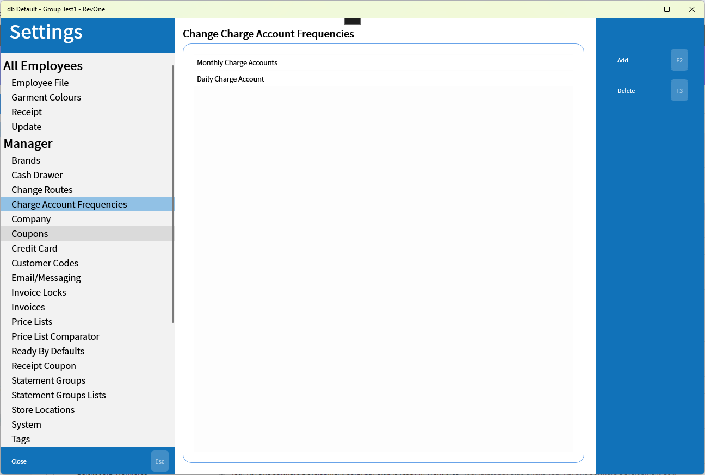
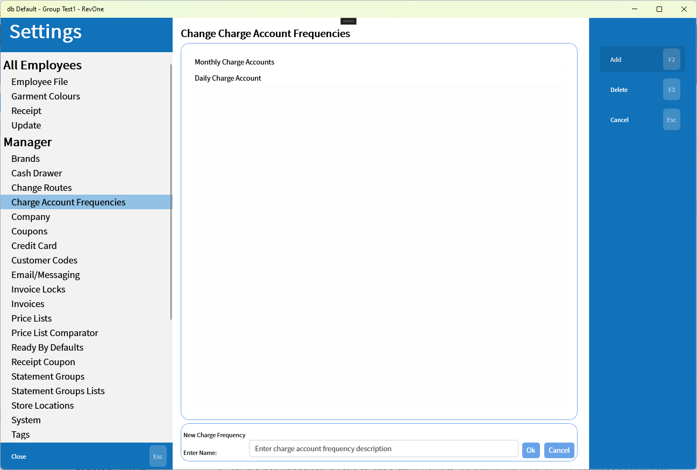

# Charge Account Frequencies
> System Wide

Sets up the list of charge account frequencies used in both [Monthly Charge Accounts (MCA)](../../Commands/Monthly-Charge-Accounts-—-MCA.md) and [Process Charge Accounts (PCA)](../../Commands/Process-Charge-Accounts-—-PCA.md)

When adding a frequency a field will appear below.

A customer's charge account frequency is set in the manager properties of their customer details page.

