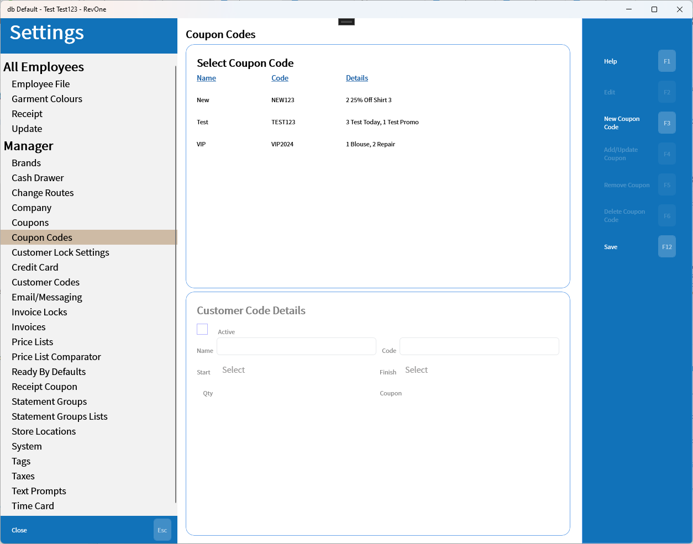
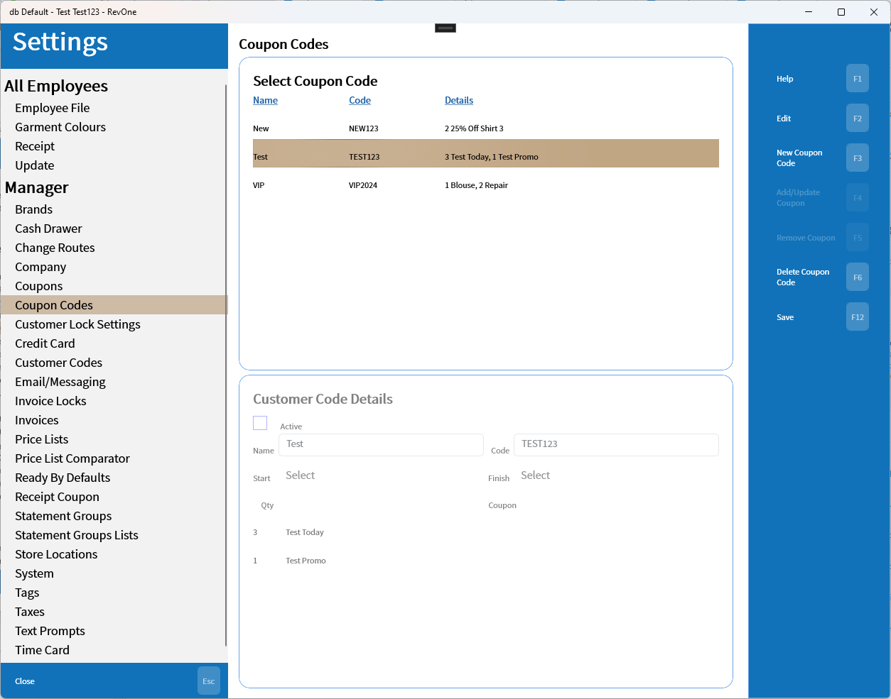

# Coupon Codes
Updated 2024-05-31 version 0.3.1055

Coupon codes allow a group of discounts to be linked to a code that can be sent by email and redeemed in store. Information about redeeming the codes can be found [Here](../../Functions/Coupon-Codes.md).

A coupon code can be added with the "New Coupon Code" button or edited by selecting a code and pressing the "Edit" button.

Once adding or editing the information can be entered and discounts can be added with the "Add Discount" button.

Deleting Coupon Codes is only allowed if the code in question has never been used.

