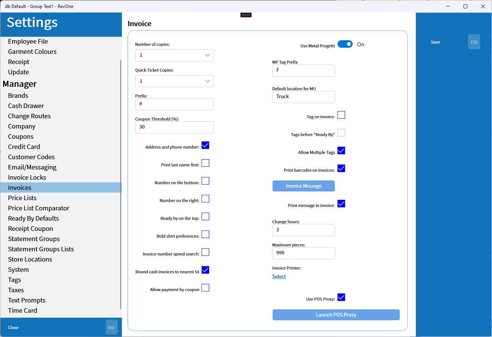
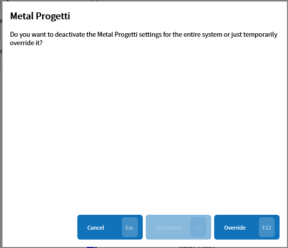

# Invoices

Settings relating to invoices.

| Setting | Explanation | Scope |
| --- | --- | --- |
| Number of copies | The number of copies of invoice receipts to print, duplicated in [Receipt](../All-Employees/Receipt.md) | Machine Specific |
| Quick Ticket Copies | The number of copies of quick ticket receipts to print, duplicated in [Receipt](../All-Employees/Receipt.md) | Machine Specific |
| Prefix | The store prefix that the current system is associated with | Machine Specific |
| Coupon Threshold | The threshold above which coupons will require manager permission. Doesn't apply to invoice coupons set in the customer settings. | Database Wide |
| Address and phone number | Print the address and phone number in the receipt. | Database Wide |
| Print last name first | Prints the customer's last name first on receipts. | Database Wide |
| Number on the bottom | Prints the invoice number on the bottom of the receipt. | Database Wide |
| Number on the right | Prints the invoice number on the right side of the receipt. | Database Wide |
| Ready by on the top | Prints the ready by status on the top of the receipt. | Database Wide |
| Bold shirt preference | Prints the shirt preference bold on receipts. | Database Wide |
| Invoice number speed search | Search invoices by partial invoice numbers | Database Wide |
| Round cash to the nearest 5¢ | Adds a rounding item to invoice paid using cash to round the transaction to the nearest 5¢ | Database Wide |
| Allow payment by coupon | Allows payment by coupon. | Database Wide |
| Use Metal Progetti | Enable/Disable/Override the Use Metal Progetti setting. [Dialog](#use-metal-progetti) | Machine Specific if deactivating but if overriding Database Wide |
| MP Tag Prefix | The prefix used for Metal Progetti tags allowing multiple databases to connect to the same physical Metal Progetti machine | Database Wide |
| Default location for MU | The default location to set items when scanning them in the [Multiple Pickup — MU](../../Commands/Multiple-Pickup-—-MU.md) command. | Database Wide |
| Tag on invoice | Enables setting tags on entire invoices vs on specific items. | Database Wide |
| Tags before "Ready By" | Sets invoice tag before opening the set ready by dialog | Database Wide |
| Allow Multiple Tags | Allows multiple tags. ❗ _May be deprecated?_ | Database Wide |
| Print barcodes on invoices | Prints invoice barcodes on the receipts. | Database Wide |
| Invoice Message | Sets a message to print in invoice receipts. [Dialog](#invoice-message) | Database Wide |
| Print message in invoice | Prints the message set in the previous setting in the invoice receipt. | Database Wide |
| Change hours | ❗ _Not used?_ | Machine Specific |
| Maximum pieces | ❗ _Not used?_ | Machine Specific |
| Invoice Printer | Connects with a network printer. ❗ Largely untested use POS Proxy instead. | Machine Specific |
| Use POS Printer | Use the POS Printer utility. Bundled in the store version and should launch if it is not open on attempting to print. | Machine Specific |
| Launch POS Printer | Attempt to launch the POS Printer. | Machine Specific |

## Use Metal Progetti

In order to disable the Metal Progetti system on a permanent bases requires SuperUser permission. Overriding the setting will temporarily disable the setting for the local system. 

## Invoice Message

The dialog used to set the message being printed on the invoice receipt.

