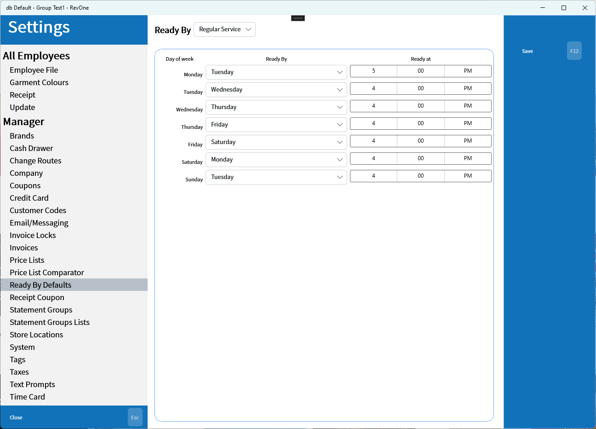
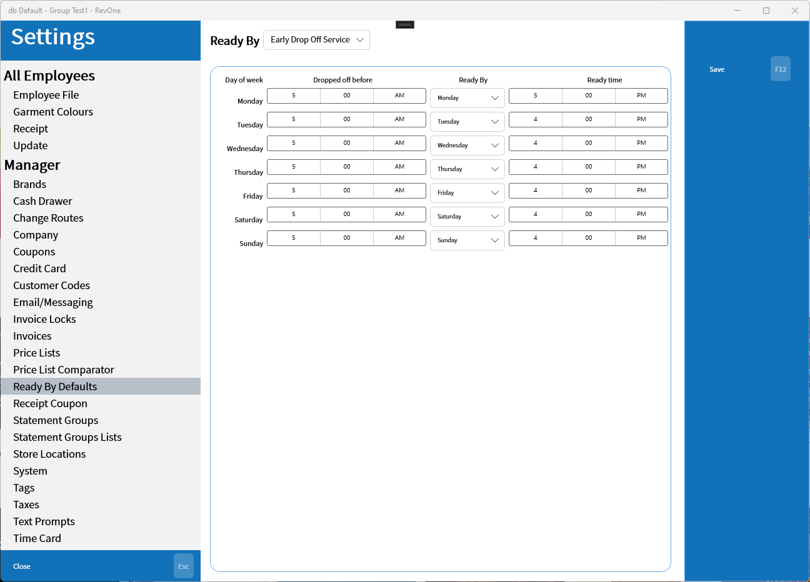

# Ready By Defaults

Sets the default Ready By date depending on day of week with option for earlier service if dropped off by a specific time of day.

The ready by dates are defiled by Regular Service and Early Drop Off Service.

Early Drop Off Service allows a different ready by date if items are dropped off earlier.

