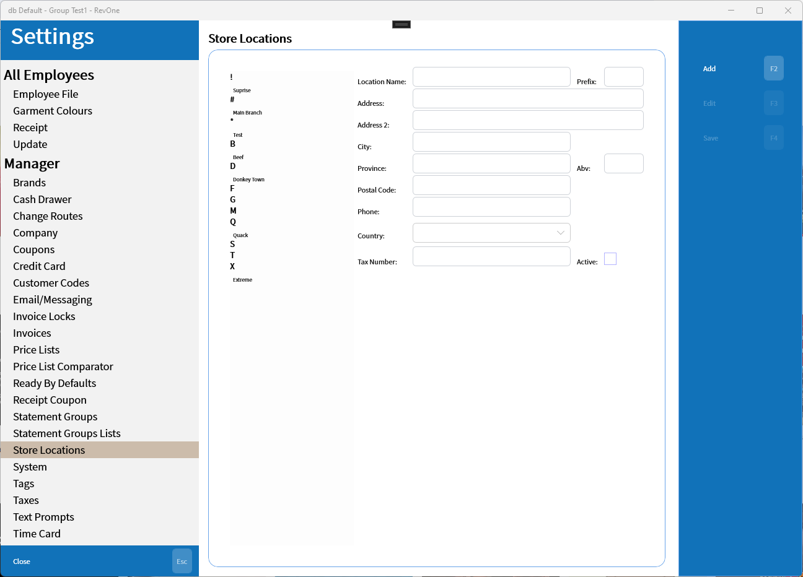

# Store Locations
Updated 2024-05-31 version 1.0.51 (0.3.1071)

Allows store locations to be linked to prefixes and the addresses and other info stored for use in reports and messages.

## Load Missing Prefixes

Sometimes there will be invoices with prefixes that haven't been added to the list of store locations. This button will fetch the missing prefixes to add to the list. This can take a while as it needs to check every invoice in the system but once the new stores have been saved it shouldn't need to be run again.