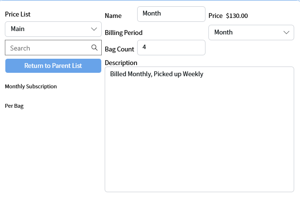
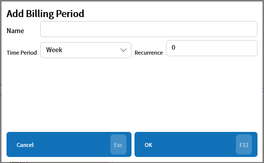

# Subscriptions
Updated 2024-05-31 version 0.3.1095

A customer can be signed up to subscriptions and this allows this to be tracked in system.

## Sub Lists

Double clicking on a sub list will open that list and show a button to return to the main list

## Delete

Only subscriptions that aren't currently being used by customers can be deleted.

## Add Billing Period

Billing periods can be set up using this button. 

A name must be set.

Each billing period needs a unique name.

## Delete Billing Period

If a billing period is not being used it can be deleted.

Only unused billing periods will be shown in the list

## Editing customer subscriptions

In the Add/Edit Customer page under the Manager Properties section the subscriptions can be added or deleted.

