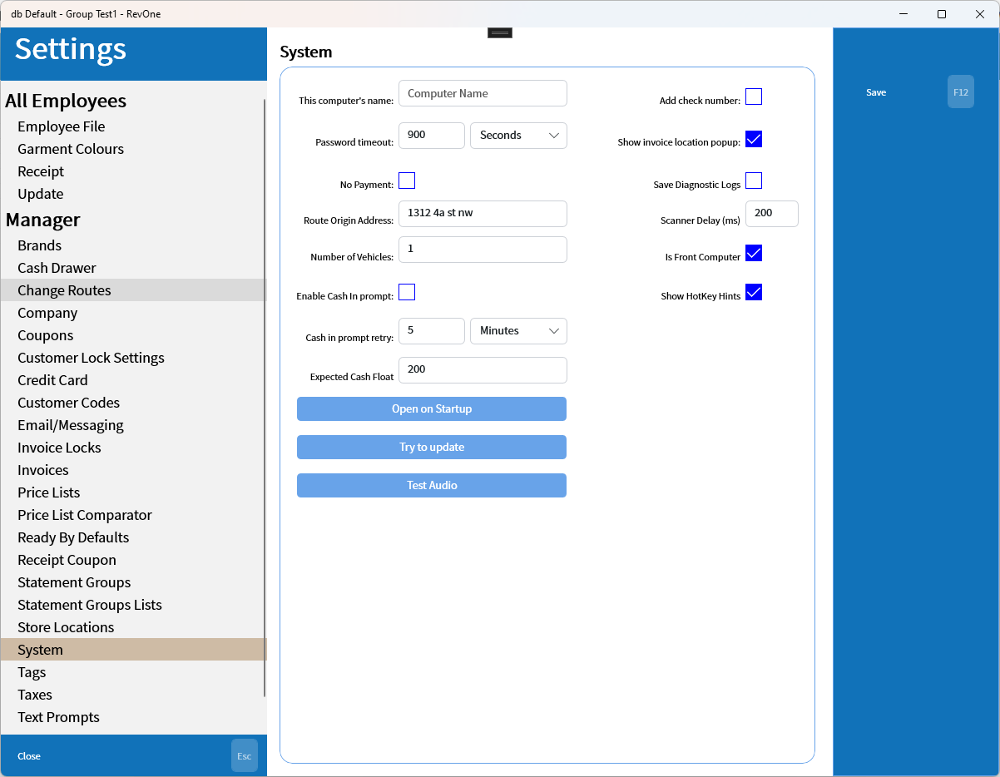
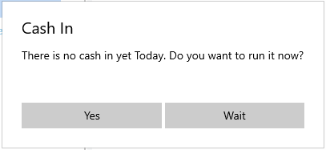

# System
Updated 2024-04-25 version 1.0.44.0 (0.3.1013)

Sets system settings.

| Setting | Explanation | Scope |
| --- | --- | --- |
| This computer's name | A nickname for the computer that is used in reports | Machine Specific |
| Password timeout | The time between requests for password entry on less secure functions | Database Wide |
| Route Origin Address | The originating location for route calculation | Database Wide |
| Number of Vehicles | The number of vehicles used to deliver routes for route calculation | Database Wide |
| Enable Cash In prompt | Enables the prompt that attempts to remind employees to cash in | Database Wide |
| Cash In prompt retry | The time to wait when clicking the Wait button on the Cash In prompt | Database Wide |
| Expected Cash Float | The expected float when cashing in. If the cash in float doesn't match it will display a confirmation prompt comparing the current float with the expected value | Database Wide |
| Open on Startup | Opens the startup setting window in Windows to allow the application to be set to open on startup | Machine Specific |
| Try to Update | Attempt to update from the Microsoft Store if an update exists | Machine Specific |
| Test Audio | Makes a sound to ensure that the confirmation sound is audible on this machine | Machine Specific |
| Show invoice location popup | Shows the List Locations popup instead of printing the results to the receipt printer |  Machine Specific |
| Save Diagnostic Logs | Saves more detailed logs to the database | Machine Specific |
| Scanner Delay (ms) | A delay between typing ending and the enter button being recognized to allow for the speed at which keyboard barcode scanners operate | Machine Specific |
|Is Front Computer | Indicates that the computer is a front facing system and enables requesting the employee for information from the customer that is missing | Machine Specific |
| Show HotKey Hints | Shows the hot key hints beside buttons | Machine Specific |

## Cash In prompt:

A prompt to try to force front staff to run the [Cash In](../../Commands/Cash-In%257COut-—-CAI%257CCAO.md) command in the morning.

