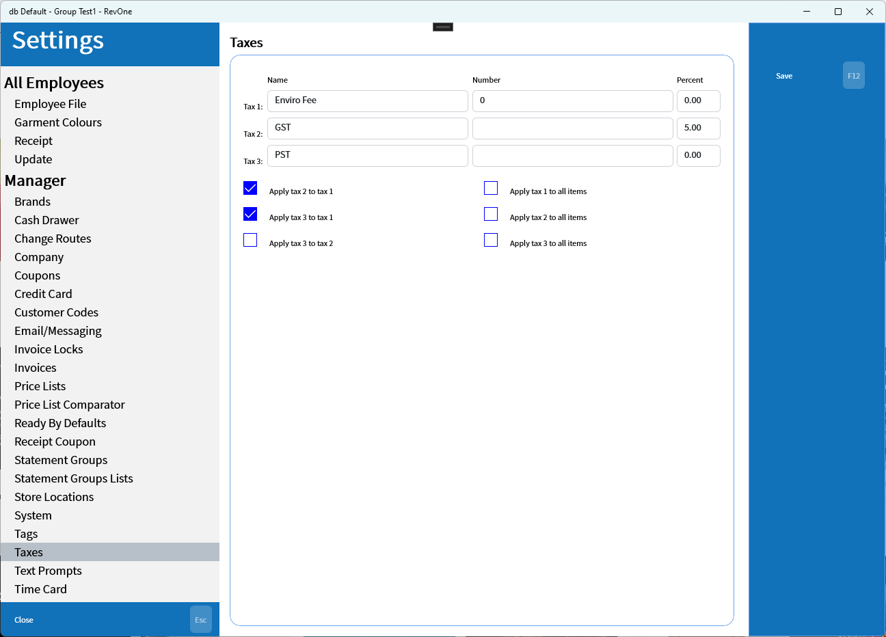

# Taxes

Settings for taxes.

| Setting | Explanation | Scope |
| --- | --- | --- |
| Tax 1/2/3 | The three tax options | Database Wide |
| Apply Tax 2 to Tax 1 Apply Tax 3 to Tax 1 Apply Tax 3 to Tax 2  | Indicates whether to calculate the tax value on top of previous tax value or on the invoice sub total | Database Wide |
| Apply Tax # to all items | Determines if a new Item (F5) created in invoice will default to having the tax enabled | Database Wide |