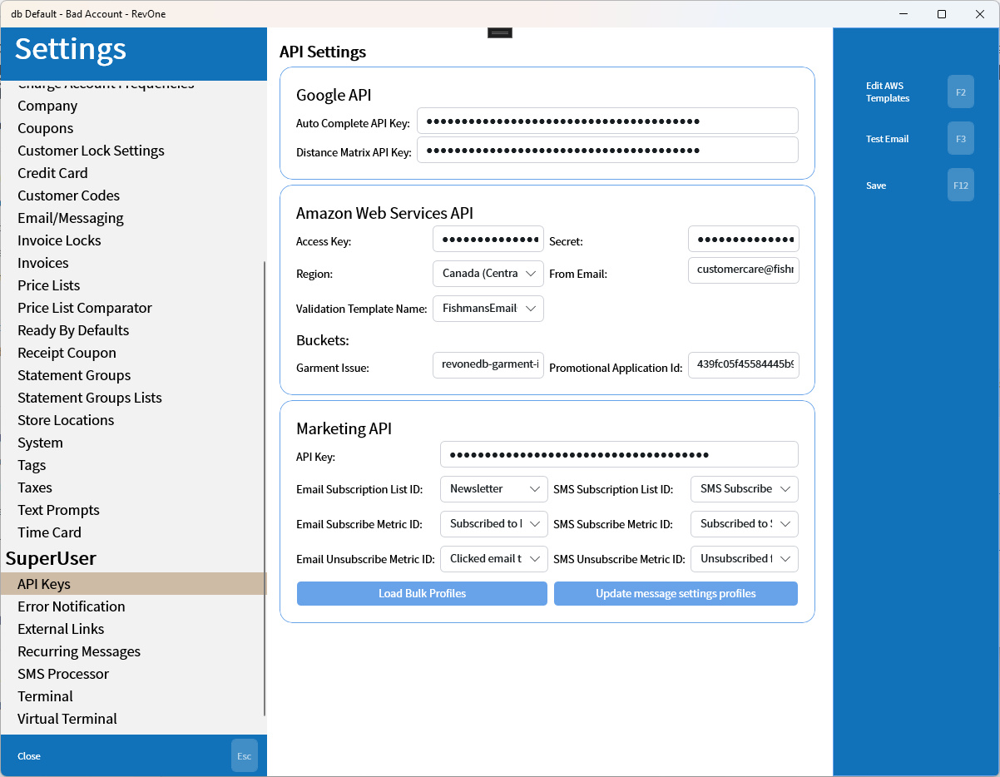
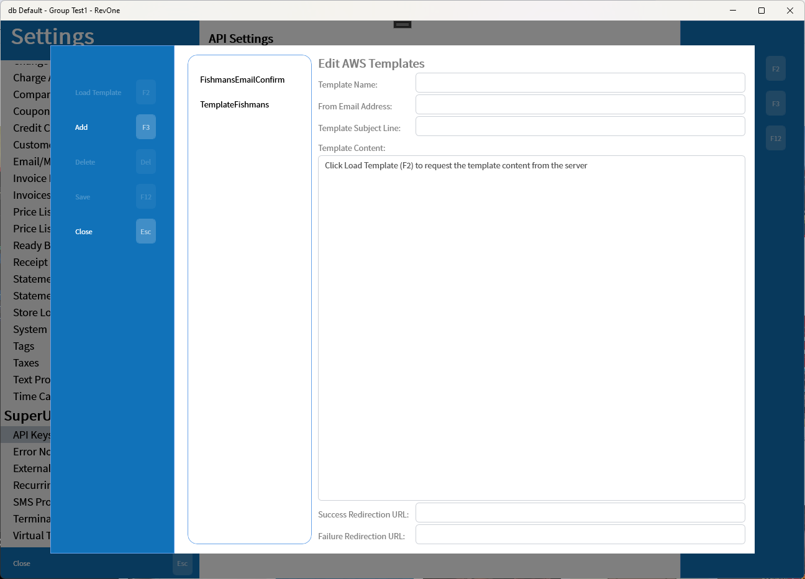
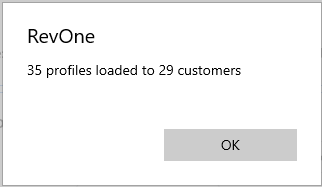
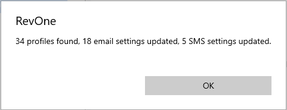

# API Keys
Updated 2024-05-13 version 1.0.48 (0.3.1036)

Set keys for external APIs.

## Edit AWS Pinpoint email templates.

Allows editing the AWS templates from inside the POS system

## Marketing API

### Load Bulk Profiles

When customer profiles have been uploaded in bulk through CSV the profile IDs need to be pulled and associated back with the customers. This button will pull the current list of profiles from the marketing API and associate them with customers with matching Customer IDs. It will then display the number of profiles that were pulled and the number that were loaded.

The loaded amount is generally going to be lower than the number of customers due to split profiles and the admin account having it's own profile that doesn't match with any customer.

### Update message settings profiles

This pulls a list of profiles from the marketing API and updates the promotional email/SMS flags based on if the marketing system has them as subscribed to the respective service. It also synchronizes the profile IDs with the customer IDs if they aren't already.

#### Minor command — Update Sub

 The minor command Update Sub or Update Subscription will pull all subscribe/unsubscribe events that occurred since the last update either using this command or the all profiles button above and update the promotional email/SMS flags. This is to reduce the API calls and only update changes.