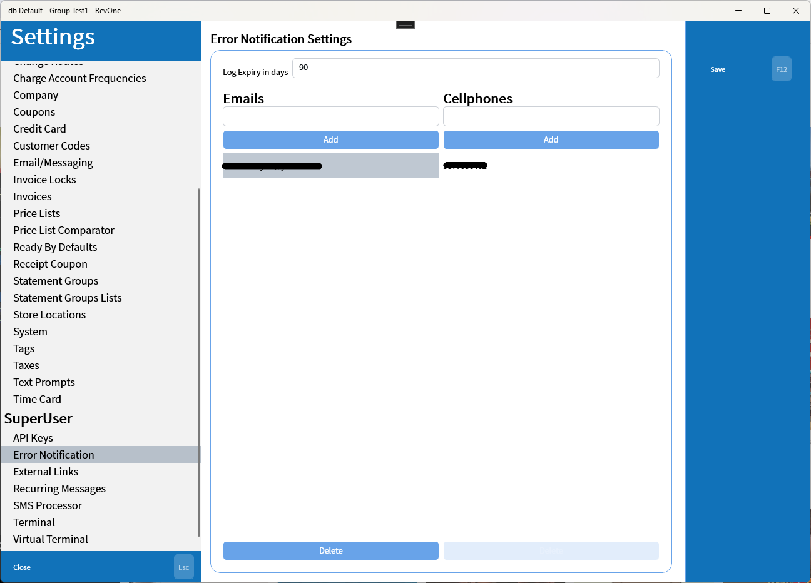

# Error Notification

> Database Wide

Settings for error notifications being sent to administrators. The log expiry is used to auto-delete old error messages to prevent the log from getting overloaded. If no email or SMS message is to be set then empty the list by selecting the items in the list and clicking delete.

