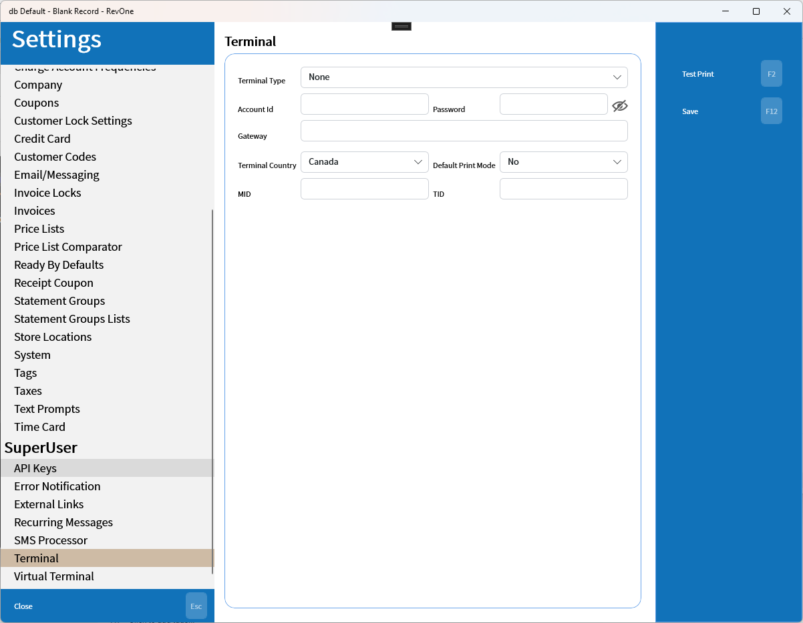

# Terminal
Updated 2024-05-21 version 1.0.48 (0.3.1031)

> Machine Specific

Setup for the local payment terminal. The MID and TID are not required but will allow reports to indicate the specific terminal used to make transaction. without this set this information will be lost.

