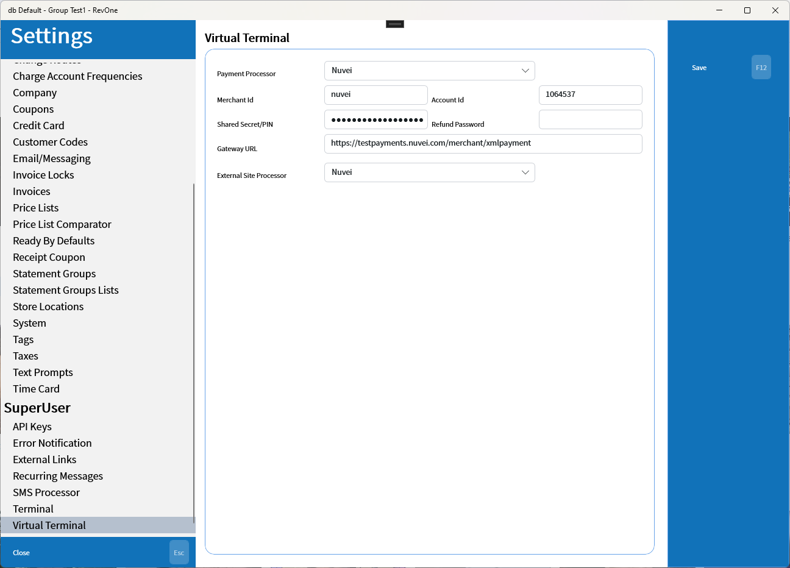

# Virtual Terminal
Updated 2024-05-21 version 0.3.1032

> Machine Specific

Setup for the virtual terminal used to make card on file transactions. The External Site Processor indicates the type of processor that the customer sign up page will use.

